[](https://packagist.org/packages/milon/barcode)
[](https://packagist.org/packages/milon/barcode)
[](https://packagist.org/packages/milon/barcode)
[](https://github.com/milon/barcode/actions/workflows/tests.yml)

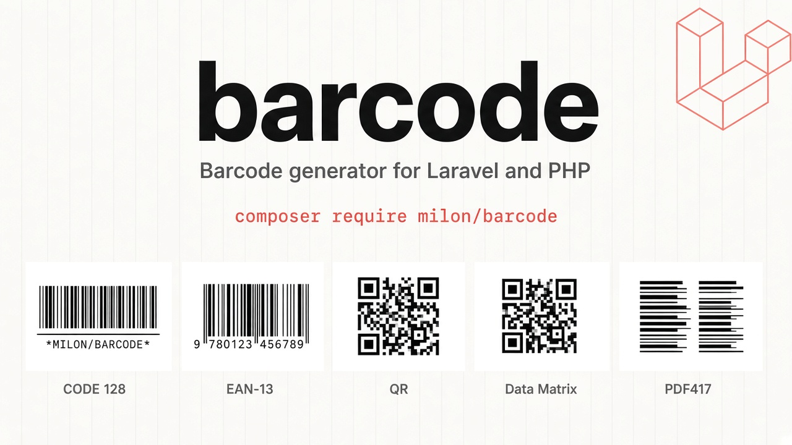

Barcode generation for Laravel and plain PHP. This package wraps the TCPDF barcode engines (1D + QR / Data Matrix / PDF417) behind a small API that returns SVG, HTML, PNG, and JPEG.

**Requires the PHP GD extension** (`ext-gd`).

Full docs: [barcode.milon.im](https://barcode.milon.im/)

Examples below are real outputs from this library. Regenerate them with:

```shell
php docs/generate-examples.php
```

---

## Installation

```shell
composer require milon/barcode
```

### Laravel compatibility

| Laravel | Package |
|---------|---------|
| 13.* | ^13.0 |
| 12.* | ^12.0 |
| 11.* | ^11.0 |
| 10.* | ^10.0 |
| 9.* | ^9.0 |
| 8.* | ^8.0 |
| 7.* | ^7.0 |
| 6.* | ^6.0 |
| 5.0–5.1 | ^5.1 |
| 4.x | ^4.2 |

Laravel 6+ auto-discovers the service provider and facades (`DNS1D`, `DNS2D`).

### Publish config (optional)

```shell
php artisan vendor:publish --provider="Milon\Barcode\BarcodeServiceProvider"
```

Default store path is the Laravel `storage` directory (used by `*Path` helpers). Ensure the directory is writable.

---

## Quick start

```php
use DNS1D;
use DNS2D;

// SVG / HTML (ready to echo)
echo DNS1D::getBarcodeSVG('CODE39DEMO', 'C39');
echo DNS2D::getBarcodeHTML('https://example.com', 'QRCODE');

// PNG / JPEG as base64 (use the data URI form)
echo '';
echo '';
```

### Blade

Always use `{!! !!}` (unescaped). PNG helpers return **raw base64**, not a full `data:` URL:

```blade
{!! DNS1D::getBarcodeHTML('5901234123457', 'EAN13') !!}


```

---

## Units: `$w` and `$h`

| API | `$w` | `$h` |
|-----|------|------|
| **DNS1D** (1D) | Width of a **single bar** in pixels | Total barcode height in pixels |
| **DNS2D** (QR / DM / PDF417) | Width of a **module** in pixels | Height of a **module** in pixels |

Larger `$w` / `$h` = larger image. Typical starting points:

- 1D labels: `$w = 2`–`3`, `$h = 50`–`80`
- QR for screen: `$w = $h = 4`–`8`
- QR for print: `$w = $h = 8`–`12`

---

## Output methods

| Method | Returns |
|--------|---------|
| `getBarcodeSVG(...)` | SVG markup string |
| `getBarcodeHTML(...)` | HTML (div/span) markup |
| `getBarcodePNG(...)` | Base64-encoded PNG |
| `getBarcodeJPG(...)` | Base64-encoded JPEG (1D) |
| `getBarcodePNGPath(...)` | Relative path to a PNG written under the store path |
| `getBarcodeJPGPath(...)` | Relative path to a JPEG written under the store path (1D) |

### Common options

**1D (`DNS1D`)**

```text
getBarcodePNG($code, $type, $w = 2, $h = 30, $color = [0,0,0], $showCode = false, $bgcolor = null)
getBarcodePNGPath($code, $type, $w = 2, $h = 30, $color = [0,0,0], $showCode = false, $bgcolor = null, $filename = null)
```

**2D (`DNS2D`)**

```text
getBarcodePNG($code, $type, $w = 3, $h = 3, $color = [0,0,0], $bgcolor = null)
getBarcodePNGPath($code, $type, $w = 3, $h = 3, $color = [0,0,0], $bgcolor = null, $filename = null)
```

- `$color` — RGB foreground `[r, g, b]` (SVG/HTML use CSS color strings)
- `$showCode` — print human-readable text under 1D bars
- `$bgcolor` — RGB background, or `null` for transparent (default)
- `$filename` — optional custom file name for `*Path` helpers (extension optional; path segments are stripped)

```php
// Custom file name → storage/.../product-42.png
DNS2D::getBarcodePNGPath($url, 'QRCODE', 6, 6, [0, 0, 0], [255, 255, 255], 'product-42');
```

### Quiet zone (padding) for print / scanners

Printed barcodes often fail to scan when bars sit flush against the page edge or other graphics. Add a quiet zone with `setPadding()` (pixels on every side):

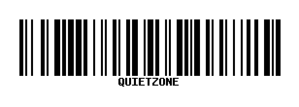

```php
// ~10× bar width is a common 1D rule of thumb ($w = 2 → padding 20)
DNS1D::setPadding(20);
echo DNS1D::getBarcodeSVG($code, 'C128', 2, 80);

DNS2D::setPadding(4 * 6); // ~4 modules around a QR with $w = 6
echo '';

DNS1D::setPadding(0); // reset (instances/facades keep the value until changed)
```

SVG output also sets `shape-rendering="crispEdges"` to reduce print-time anti-alias blur.

### QR logo (centered)

Overlay a logo on QR / Datamatrix **PNG** output (GD). Use high error correction (`QRCODE,H`) and keep the logo modest (~15–25% of width) so scanners still read the code.

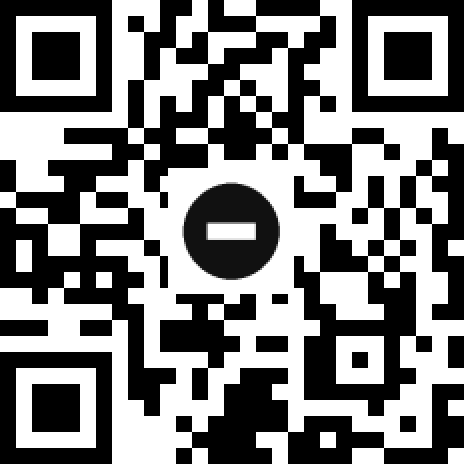

```php
DNS2D::setLogo(storage_path('app/logo.png'), 0.2);
echo '';
DNS2D::setLogo(null); // clear
```

### Retail UPC-A / EAN layout

EAN-8, EAN-13, UPC-A, and UPC-E now use **taller guard bars** and, when `$showCode` is enabled, split human-readable digits (number system / left / right / check) instead of one centered string.

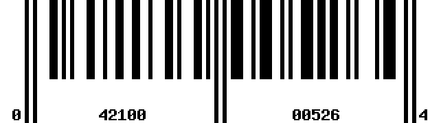

```php
echo '';
```

---

## Background color (dark UI / email)

Transparent PNGs disappear on dark backgrounds. Pass a white (or light) `$bgcolor`:

| Transparent (default) | White background |
|-----------------------|------------------|
| 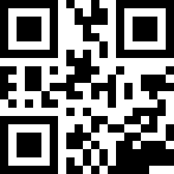 |  |

```php
// Recommended for dark themes and email clients
DNS2D::getBarcodePNG($url, 'QRCODE', 6, 6, [0, 0, 0], [255, 255, 255]);

DNS1D::getBarcodePNG('WHITEBG', 'C128', 3, 70, [0, 0, 0], false, [255, 255, 255]);
```

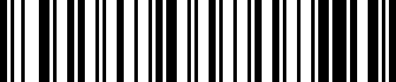

---

## Examples (with screenshots)

### CODE 39

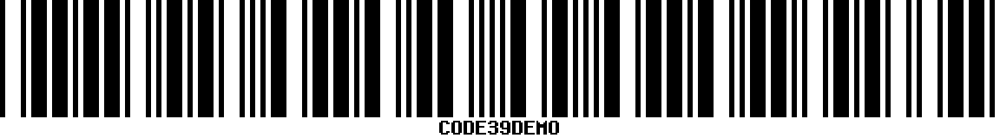

```php
DNS1D::getBarcodePNG('CODE39DEMO', 'C39', 3, 80, [0, 0, 0], true, [255, 255, 255]);
```

### CODE 39+

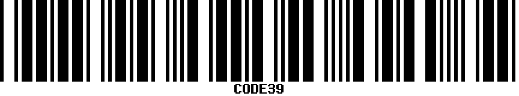

```php
DNS1D::getBarcodePNG('CODE39', 'C39+', 3, 80, [0, 0, 0], true, [255, 255, 255]);
```

### CODE 128

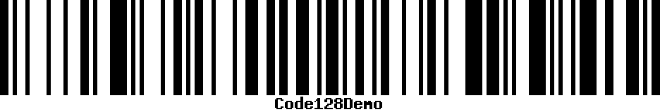

```php
DNS1D::getBarcodePNG('Code128Demo', 'C128', 3, 80, [0, 0, 0], true, [255, 255, 255]);
```

### CODE 128A / 128B / 128C

| C128A | C128B | C128C |
|-------|-------|-------|
| 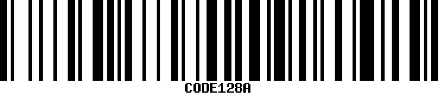 | 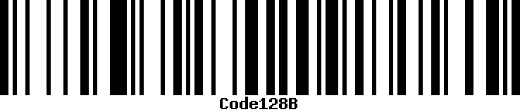 | 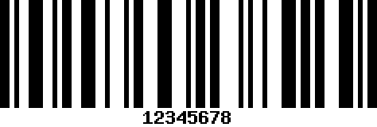 |

```php
DNS1D::getBarcodePNG('CODE128A', 'C128A', 3, 80, [0, 0, 0], true, [255, 255, 255]);
DNS1D::getBarcodePNG('Code128B', 'C128B', 3, 80, [0, 0, 0], true, [255, 255, 255]);
DNS1D::getBarcodePNG('12345678', 'C128C', 3, 80, [0, 0, 0], true, [255, 255, 255]); // digits, even length
```

### EAN-13 / EAN-8 / UPC-A

| EAN-13 | EAN-8 | UPC-A |
|--------|-------|-------|
| 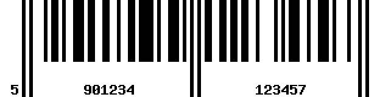 | 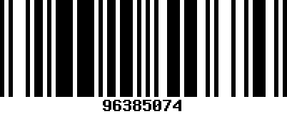 | 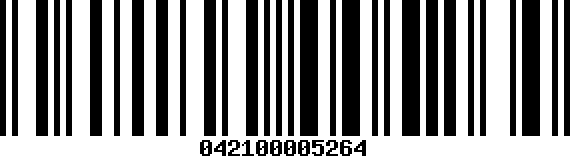 |

```php
DNS1D::getBarcodePNG('5901234123457', 'EAN13', 3, 80, [0, 0, 0], true, [255, 255, 255]);
DNS1D::getBarcodePNG('96385074', 'EAN8', 3, 80, [0, 0, 0], true, [255, 255, 255]);
DNS1D::getBarcodePNG('042100005264', 'UPCA', 3, 80, [0, 0, 0], true, [255, 255, 255]);
```

### Interleaved 2 of 5 / Codabar / Pharmacode

| I25 | Codabar | Pharmacode |
|-----|---------|------------|
| 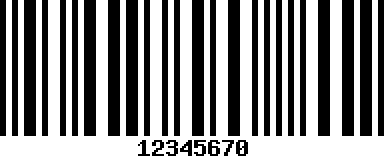 | 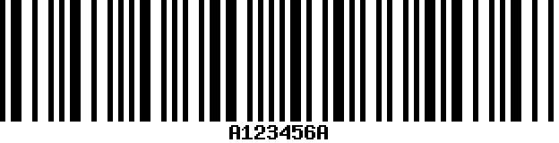 | 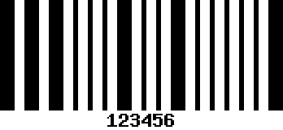 |

```php
DNS1D::getBarcodePNG('12345670', 'I25', 3, 80, [0, 0, 0], true, [255, 255, 255]);
DNS1D::getBarcodePNG('A123456A', 'CODABAR', 3, 80, [0, 0, 0], true, [255, 255, 255]);
DNS1D::getBarcodePNG('123456', 'PHARMA', 3, 80, [0, 0, 0], true, [255, 255, 255]);
```

### Custom bar color

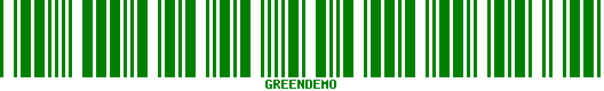

```php
DNS1D::getBarcodePNG('GREENDEMO', 'C39', 3, 80, [0, 128, 0], true, [255, 255, 255]);
```

### QR Code / Data Matrix / PDF417

| QR Code | Data Matrix | PDF417 |
|---------|-------------|--------|
| 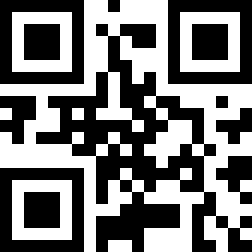 | 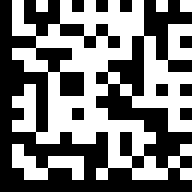 | 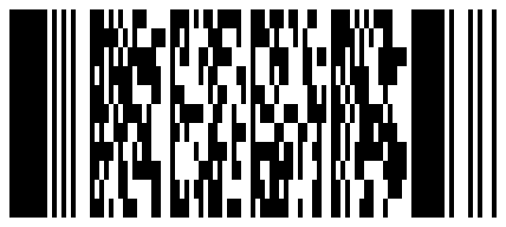 |

```php
DNS2D::getBarcodePNG('https://milon.im', 'QRCODE', 6, 6, [0, 0, 0], [255, 255, 255]);
DNS2D::getBarcodePNG('DM-DEMO-12345', 'DATAMATRIX', 6, 6, [0, 0, 0], [255, 255, 255]);
DNS2D::getBarcodePNG('PDF417 Demo Payload', 'PDF417', 3, 3, [0, 0, 0], [255, 255, 255]);
```

Browse all generated samples: [`docs/examples/gallery.html`](docs/examples/gallery.html)

Regenerate images + gallery:

```shell
php docs/generate-examples.php
```

---

## Symbology character sets

Invalid input throws `Milon\Barcode\InvalidBarcodeException` with a hint for the chosen type.

| Type | Allowed data (practical) |
|------|--------------------------|
| **C39** | `0-9 A-Z` space and `-.$/+%` |
| **C39E** / **C39E+** | Full ASCII (extended CODE 39) |
| **C128** | Full ASCII; auto code-set |
| **C128A** | Uppercase / control; **no lowercase** — use C128B or C128 |
| **C128B** | Full ASCII |
| **C128C** | **Digits only**, encoded in pairs (even length) |
| **EAN13** | 12–13 digits (check digit calculated/validated) |
| **EAN8** | 7–8 digits |
| **UPCA** | 11–12 digits |
| **UPCE** | Compressed UPC-E digit form |
| **I25** / **S25** | Digits (I25 prefers even length) |
| **CODABAR** | Digits plus `-$:/.+` with A–D start/stop |
| **PHARMA** | Numeric pharmacode |
| **QRCODE** | Text/URL; capacity depends on version/ECC |
| **DATAMATRIX** | Text; capacity depends on symbol size |
| **PDF417** | Longer text payloads |

Prefer **C128** (auto) unless you specifically need A/B/C.

### Also supported (1D)

`C39+`, `C93`, `S25`, `S25+`, `I25+`, `GS1-128`, `EAN2`, `EAN5`, `MSI`, `MSI+`, `POSTNET`, `PLANET`, `RMS4CC`, `KIX`, `IMB`, `CODE11`, `PHARMA2T`

---

## Standalone PHP (no Laravel)

Laravel is optional. Without a container, the store path defaults to the system temp directory (or whatever you set):

```php
use Milon\Barcode\DNS1D;
use Milon\Barcode\DNS2D;

$d1 = new DNS1D();
$d1->setStorPath(__DIR__ . '/cache/');

echo $d1->getBarcodeHTML('9780691147727', 'EAN13');
echo 'getBarcodePNG('9780691147727', 'EAN13') . '">';

$d2 = new DNS2D();
$d2->setStorPath(__DIR__ . '/cache/');
file_put_contents(
    __DIR__ . '/cache/qr.png',
    base64_decode($d2->getBarcodePNG('https://example.com', 'QRCODE', 6, 6, [0, 0, 0], [255, 255, 255]))
);
```

Use the **instance** API (or the Laravel facade). Calling `DNS2D::getBarcodePNG()` as a static method on the class itself will not work.

---

## FAQ

**Why is my Blade barcode empty / escaped HTML?**  
Use `{!! DNS1D::getBarcodeHTML(...) !!}`, not `{{ }}`.

**Why is the `` broken?**  
PNG helpers return base64 only. Prefix with `data:image/png;base64,`.

**Barcode works in light mode but not dark mode / email?**  
Pass a solid `$bgcolor`, e.g. `[255, 255, 255]`.

**Printed barcode won’t scan reliably?**  
Add a quiet zone (`setPadding(...)`), use a larger `$w` (avoid `$w = 1` for print), and prefer SVG/PNG over scaled-down screen captures. See [Quiet zone](#quiet-zone-padding-for-print--scanners).

**`InvalidBarcodeException`?**  
The payload does not match the symbology (see table above). Switch type or sanitize input.

**Can this package scan barcodes from a camera?**  
No. It only **generates** barcodes. Scanning needs a separate library or device SDK.

**Can it authenticate users / replace login?**  
No. Generating a QR of a URL or token is not authentication by itself.

---

## License

GNU LGPLv3. Copyright [Nuruzzaman Milon](https://milon.im). Original barcode classes by Nicola Asuni / Tecnick.com LTD ([TCPDF](https://tcpdf.org)).

### [Buy me a coffee](https://paypal.me/tomilon?locale.x=en_US)
